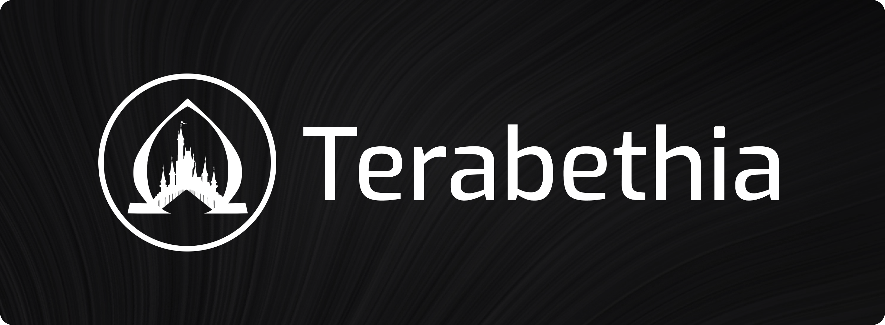

# Welcome to Terabethia

Terabethia is a bridge between Ethereum & the Internet Computer  that contracts in both chains can use to message each other, and that Ethereum assets (ERC20, ERC721, & ERC1155) can use to be automatically mirrored & used on the IC.

- Visit [our website](https://terabethia.ooo)
- Visit [our repository](https://github.com/psychedelic/terabethia)
- Follow [us on Twitter](https://twitter.com/terabethia_) 

!!! Important

    This is a Testnet V2 version of Terabethia ✨ intended for testing, gathering developer feedback, and auditing as we move forward with the development needed for a mainnet release. Any developer can start building on Terabethia's testnet contracts to send messages between contracts across both chains. 

## 🧰 Getting Started with Terabethia's Testnet

To get started with Terabethia,  visit our getting started section! You can start using our testnet contracts and following our examples to get familiar with the usage and integration flow for Terabethia.

1. [Terabethia's Testnet Intro](https://docs.terabethia.ooo/terabethia-testnet/getting-started/)
2. [ETH & WETH Example](https://docs.terabethia.ooo/terabethia-testnet/eth-weth/)
3. [Terabethia Repository](https://github.com/psychedelic/terabethia)
