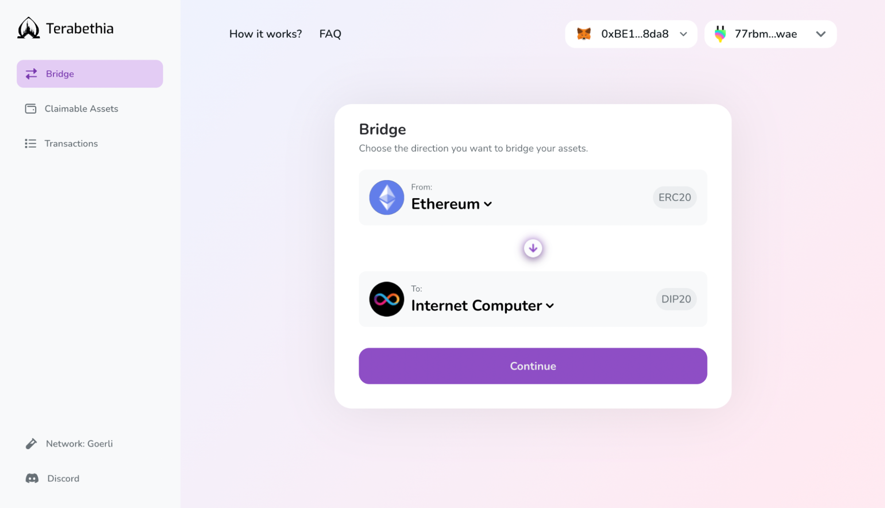
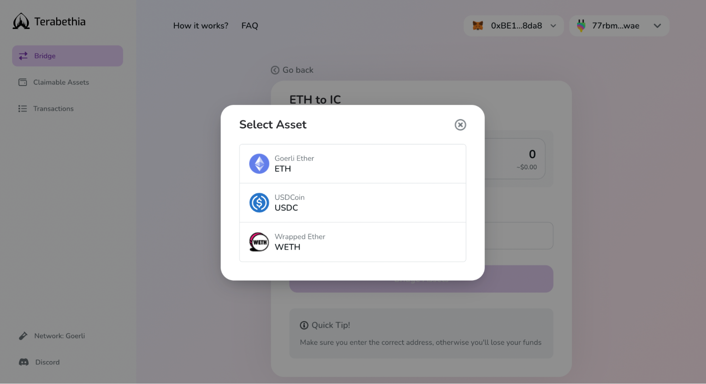
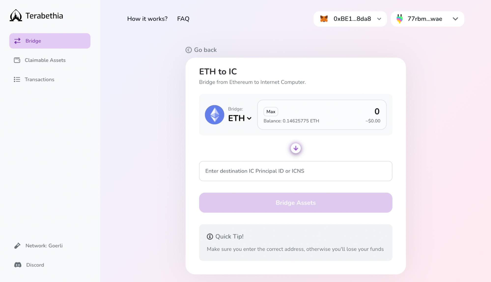
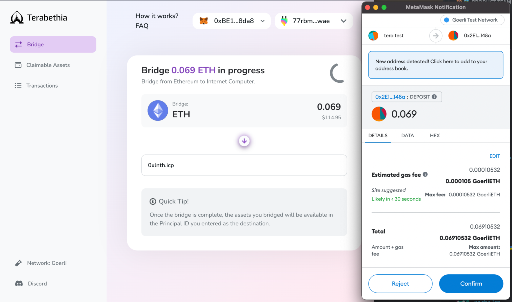
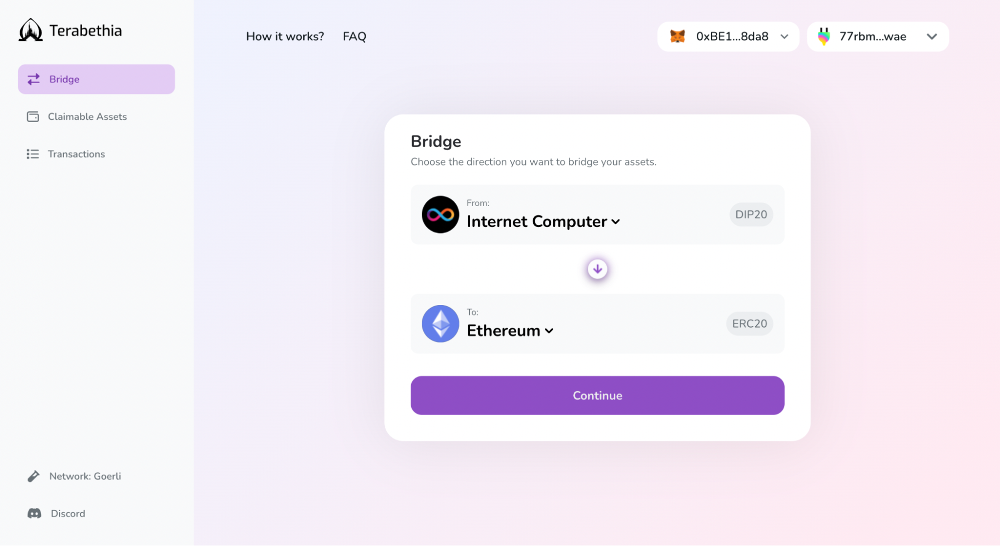
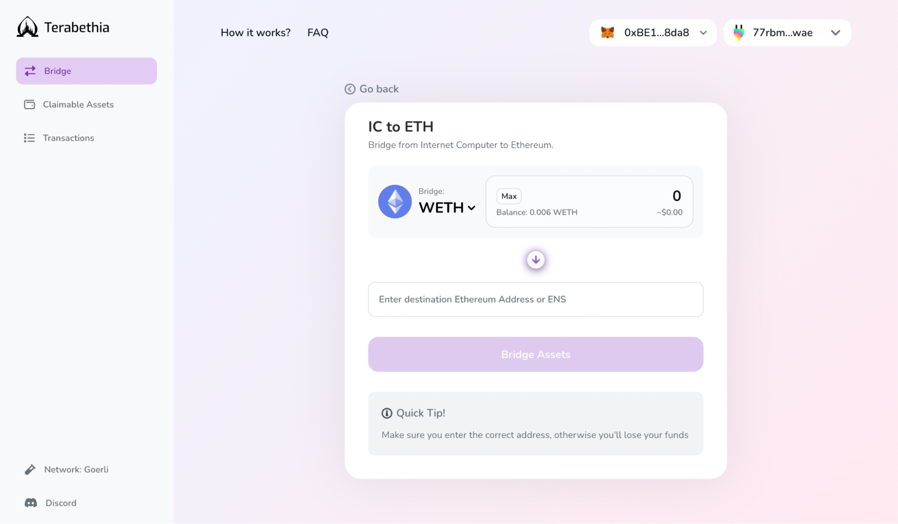
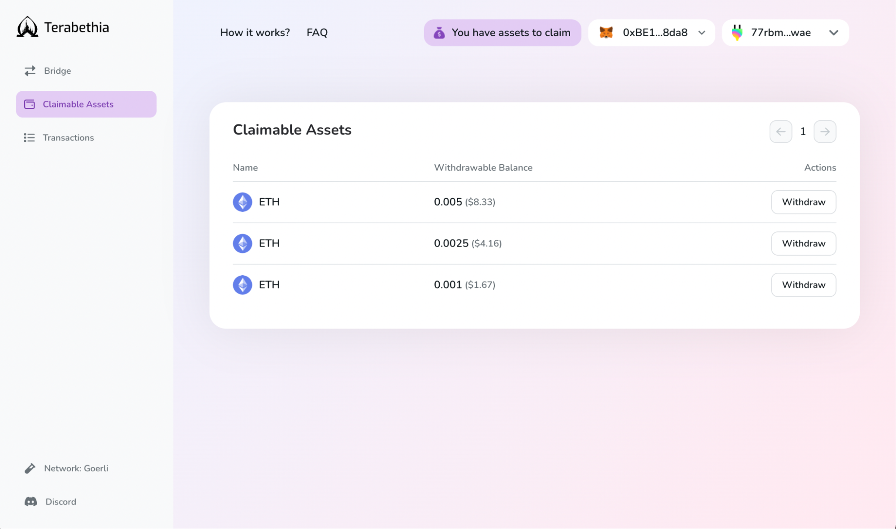
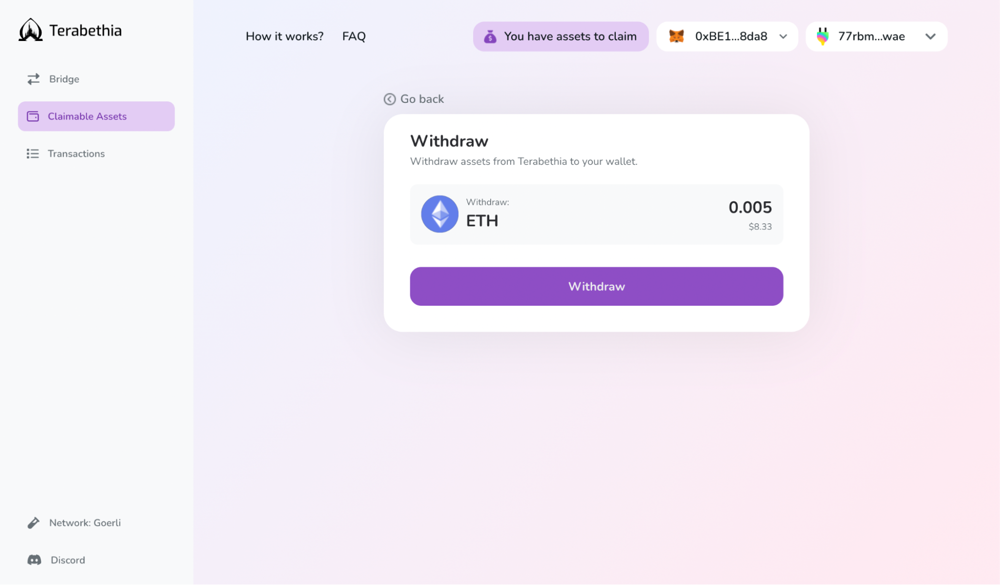
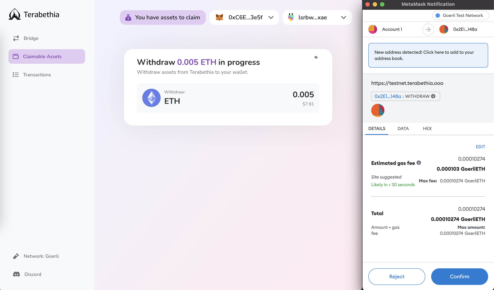
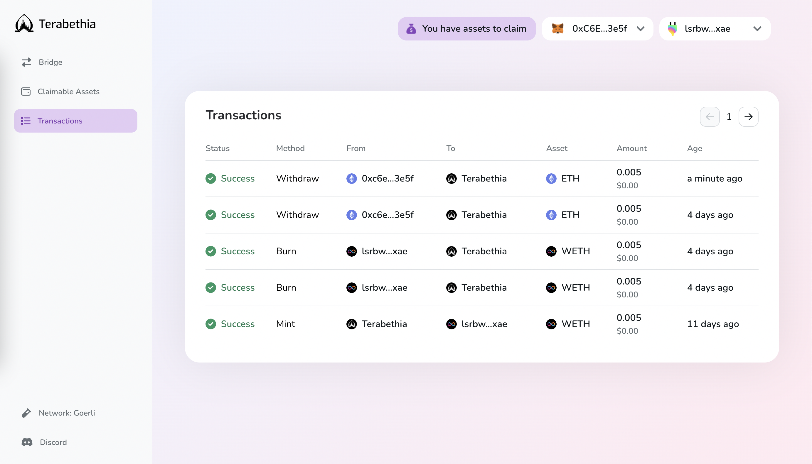

You can currently swap three main tokens between Ethereum and the IC: ETH, wETH, and USDC, but will be able to do so for any ERC-20 token once we expand Terabethia’s bridging functionality in subsequent releases.

Head over to https://testnet.terabethia.ooo/ and follow the steps below to start bridging your tokens. For Goerli testnet ETH, head over to the link below and follow the step-by-step guide.

  * [Get Goerli ETH](https://goerlifaucet.com/)

## Ethereum > IC
**Connect your Metamask** or WalletConnect-supported wallets, **and your Plug account** & choose the blockchain you want to bridge your token to. With only two networks available, the blockchain destination field will automatically flip when switching between Ethereum and the IC.

Select the Ethereum network

Select your preferred token, choose the amount you want bridged over, and paste the principal ID or ICNS domain name from your Plug account.

Select your preferred token

Select the amount & add ICNS or the principal ID address

- ***Note:*** Directly bridge your Ethereum tokens to any account by adding the Plug principal ID instead of yours.
&nbsp

Once you click “**Bridge Assets**” you will see two Metamask pop-ups asking to approve the transactions and allow Plug to receive the new tokens. 

While in the backend token bridging goes through a two-step process, you only need to **approve** and **pay gas fees once**. Your tokens are first transferred from your Ethereum wallet address to the EthProxy, and then to your IC wallet address.

Approve the transaction in your wallet

You have now successfully bridged your tokens!

- ***Note:*** To see your bridged DIP-20 standard tokens in Plug, you need to add wETH or USDC as custom tokens in your wallet by selecting DIP-20 as the token standard and the corresponding canister ID. A pop-up will then appear to auto import the token into Plug.

## IC > Ethereum

Bridging your wrapped tokens back to Ethereum involves a two-step process.

First, switch the blockchain destination field to Ethereum, and select the token you want bridged over. 

Select the Internet Computer network

Choose the token amount, add the destination Ethereum wallet address (or the ENS domain name) from Metamask or WalletConnect-supported wallets, and click on the “**Bridge Assets**” button.

Select the amount & add the ENS or Ethereum wallet address

Your assets are then sent to the ETH Proxy and now appear under the “**Claimable Assets**” tab. 

- ****EthProxy**** is a two-method smart contract on the Ethereum network, which holds, deposits, or withdraws $ETH, and calls the $ETH balance stored in the contract.

Select the ETH amount to withdraw

Under the “**Claimable Assets**” tab, select your partially bridged tokens and click “**Withdraw**”. This will prompt a second transaction which will unlock your assets from the smart contracts on Ethereum, back into your Metamask or WalletConnect wallet. 

You will be prompted to another screen where you will see the token and amount selected. **Click “Withdraw” again** in order to **confirm the bridging transaction**.

- ***Note:***  In this release **you cannot partially withdraw an asset**! Each claimable asset instance must be withdrawn in full or not at all.
- The transaction verification process may take some time while on testnet. Please return in a few minutes to claim your assets.

Withdraw the ETH amount

Once clicked, you will be redirected to a Metamask or WalletConnect pop-up for transaction approval and gas fee payment.

Once successful, you will see your asset inside your wallet.

**Congrats!** You have successfully bridged your assets back to Ethereum.

For your transaction history, head over to the “**Transactions**” tab, where you will see a “**Burn**” transaction corresponding to the recent withdrawal.

