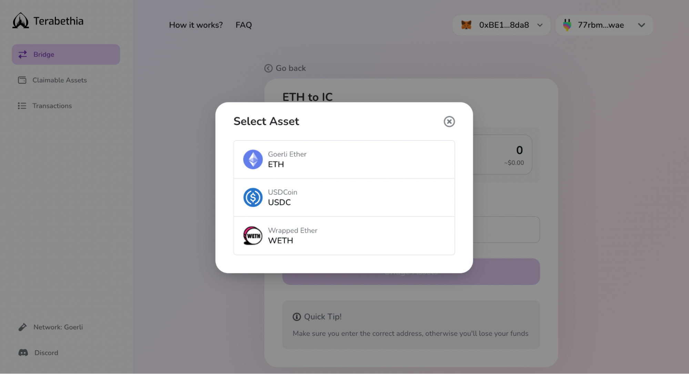
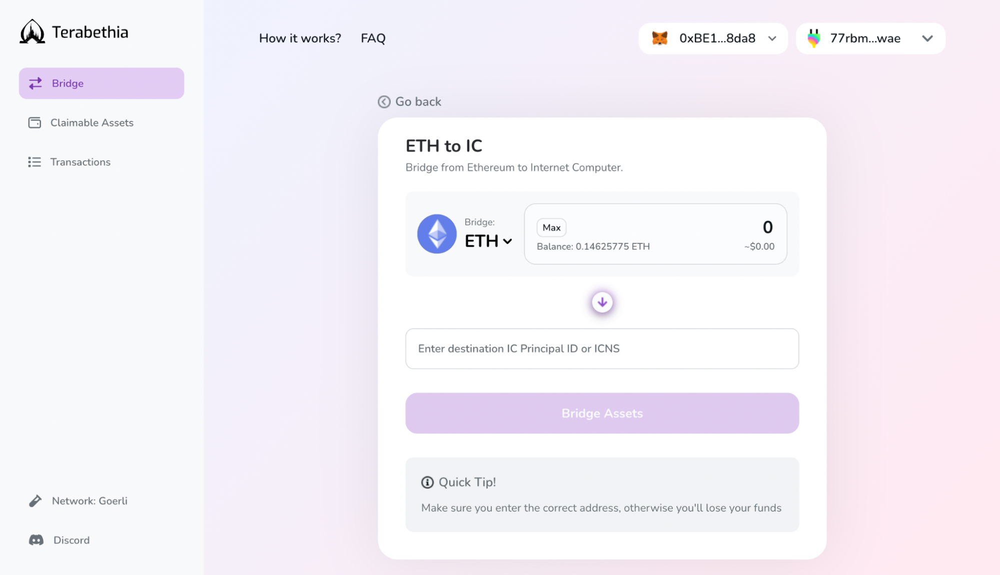
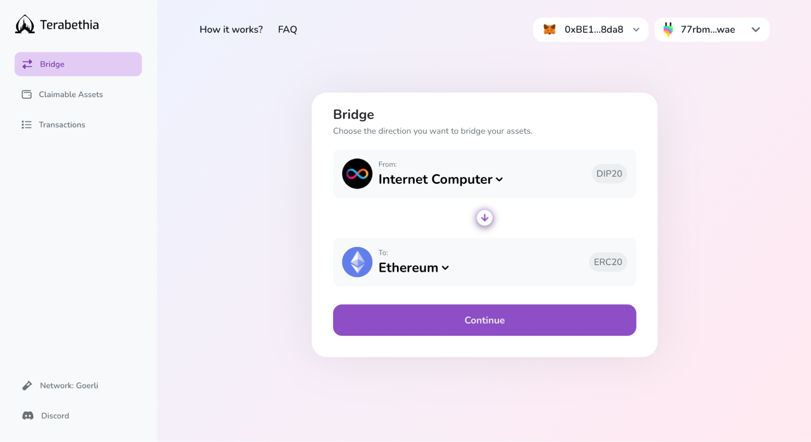
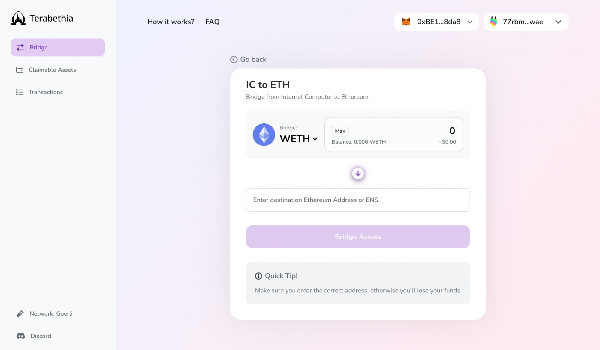

# Bridge UI How To 

## Bridge UI How To 

Let's dive into how to bridge Goerli ETH testnet tokens from Ethereum to the Internet Computer through Terabethia. Tokens available for bridging (Goerli): **ETH**, **wETH**, **USDC**.

 * [Get Goerli ETH](https://goerlifaucet.com/)

## Ethereum to IC
### Step 1 - Connect Your Wallets
**Connect your Metamask** or WalletConnect-supported wallets, **and your Plug account** & choose the blockchain you want to bridge your token to. With only two networks available, the blockchain destination field will automatically flip when switching between Ethereum and the IC.

Select the Ethereum network

### Step 2 - Select Your Token, Amount, & IC Destination

Select your preferred token, choose the amount you want bridged over, and paste the principal ID or ICNS domain name from your Plug account.

Select your preferred token

Select the amount & add ICNS or the principal ID address

> ***Note:*** Directly bridge your Ethereum tokens to any account by adding the Plug principal ID instead of yours.

### Step 3 - Bridge Your Assets

Once you click “**Bridge Assets**” you will see two Metamask pop-ups asking to approve the transactions and allow Plug to receive the new tokens. 

While in the backend token bridging goes through a two-step process, you only need to **approve** and **pay gas fees once**. Your tokens are first transferred from your Ethereum wallet address to Terabethia's bridge contract on ETH. Then, your IC wallet address is minted a 1:1 amount of the wrapped token equivilant on the IC.

Approve the transaction in your wallet

You have now successfully bridged your tokens! A pop-up will then appear to auto import the token into Plug so you can view your bridged token balance.

> ***Note:*** To see your bridged DIP-20 standard tokens in Plug, you need to add wETH or USDC as custom tokens in your wallet by selecting DIP-20 as the token standard and the corresponding canister ID. 

## IC back to Ethereum

### Step 1 - Select Ethereum As Destination

Bridging your wrapped tokens back to Ethereum involves a two-step process.

First, switch the blockchain destination field to Ethereum, and select the token you want bridged over. 

Select the Internet Computer network

### Step 2 - Select Your Token, Amount, & Ethereum Destination

Choose the token amount, add the destination Ethereum wallet address (or the ENS domain name) from Metamask or WalletConnect-supported wallets, and click on the “**Bridge Assets**” button.

Select the amount & add the ENS or Ethereum wallet address

### Step 3 - Claim Your Assets On ETH

Your assets are then sent to an ETH smart contract controlled by Terabethia and now appear under the “**Claimable Assets**” tab. At this point, your tokens on the IC are burned and ready to be unlocked on ETH.

Select the ETH amount to withdraw

Under the “**Claimable Assets**” tab, select the specific bridged assets instance you'd like to claim by clicking “**Withdraw**”. 

You will be prompted to another screen where you will see the token and amount selected. **Click “Withdraw” again** in order to **confirm the bridging transaction**.

> ***Note:***  In this release **you cannot partially withdraw an asset**! Each claimable asset instance must be withdrawn in full or not at all.

Withdraw the ETH amount

You will be redirected to a Metamask or WalletConnect pop-up for transaction approval and gas fee payment for the withdrawal of assets out of the ETH bridge contract.

Once the p

**Congrats!** You have successfully bridged your assets back to Ethereum.

For your transaction history, head over to the “**Transactions**” tab, where you will see a “**Burn**” transaction corresponding to the recent withdrawal.

