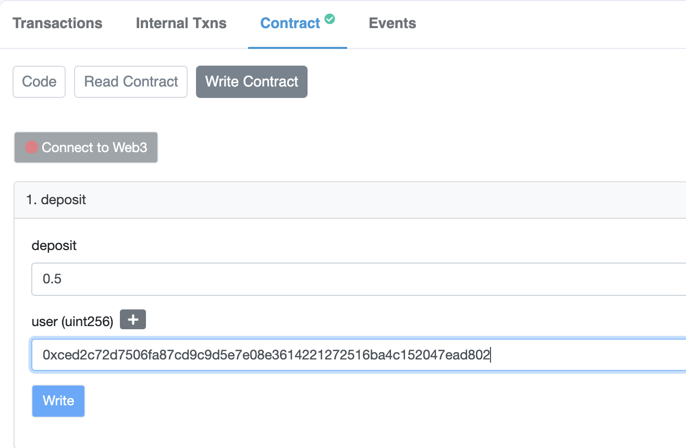
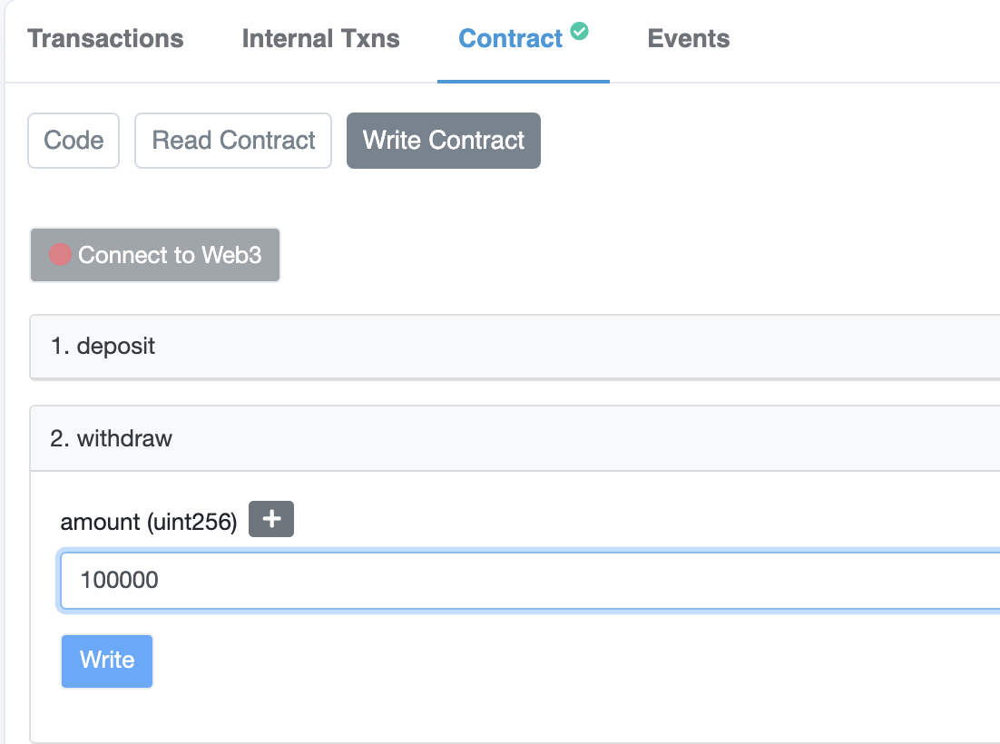

# Terabethia - Testnet ETH <> WETH Example

## Terabethia - Testnet ETH <> WETH Example

As an example use-case and example implementation of Terabethia, we created Wrapped Ethereum on the IC (using Goerli Ether, of course, so purely a test and no real monetary value). It showcases:

- How contracts can use Terabethia to communicate across the IC<>ETH
- The potential for mirroring assets from Ethereum onto the Internet Computer

It is a three-contract implementation. A proxy contract on Ethereum receives Goerli Ether deposits from a user, locks them, and sends a mint message to the Internet Computer by calling the Terabethia bridge contract.

That message is sent to a WETH proxy canister on the IC that consumes the message and tells the WETH ([DIP20](https://github.com/Psychedelic/DIP20)) token canister to mint an equivalent amount of Wrapped Ethereum on IC.

Here's the repository of both IC-side contracts (proxy, and token):

- [WETH Proxy (IC)](https://github.com/Psychedelic/terabethia/blob/master/ic/w_eth/src/eth_proxy/src/lib.rs)
- [WETH Proxy (ETH)](https://github.com/Psychedelic/terabethia/blob/master/eth/contracts/EthProxy.sol)
- [WETH Token Contract (IC)](https://github.com/Psychedelic/terabethia/blob/master/ic/w_eth/src/token/token.did)

## Quick Flow Guide 🧰

Let's go through the flow of using the  proxy on Ethereum to mint WETH on the Internet Computer!

> Remember, this it **not real ETH**. It is testnet, Goerli ETH.

--- 

### 1) Deposit ETH in the Ethereum WETH Proxy Contract

> Make sure you have Goerli ETH, get it from a faucet like https://faucet.goerli.mudit.blog/

First, you need to deposit ETH to the WETH Proxy contract **on Ethereum**. The contract will lock your ETH, and call the WETH proxy contract on the IC through Terabethia to tell the WETH token contract to mint an equivalent balance.

Do so by calling the following method, passing the destination Principal ID (address on the IC that will own the WETH balance).

- ETH Proxy Contract address: `0x1b864e1CA9189CFbD8A14a53A02E26B00AB5e91a`

You can easily deposit by going to [WETH Proxy - Goerli](https://goerli.etherscan.io/address/0x1b864e1ca9189cfbd8a14a53a02e26b00ab5e91a#writeContract) etherscan:



- ***NOTE:*** the `user` here is a Principal ID as hex.
```js
import { Principal } from '@dfinity/principal';

const hexString = Principal.fromText('<PID_HERE>').toHex().toLowerCase();
```

**What is happening in the background?**

Here, the proxy will call Terabethia's `sendMessage` method to pass on the mint instruction to the IC. Terabethia's serverless infrastructure picks it up to ensure there are no duplicate transactions, parses & validates the payload, and sends it to the IC.

From the IC's side, Terabethia will receive the message, store it, and triggers the IC-side Proxy contract to reproduce the message and call the mint function on the WETH contract.

----

### 2) Check your WETH Balance on the Internet Computer

Now that you have minted WETH through the proxy contract on Ethereum, **let's check that you've received an equivalent minted balanced on the IC**!

- WETH Token Contract Canister ID: `sbuvx-eyaaa-aaaab-qad6a-cai`

You can check by calling the balanceOf method:

```sh
dfx canister --network ic call sbuvx-eyaaa-aaaab-qad6a-cai balanceOf '(principal "<PID_HERE>")'
```

Awesome! You have Goerli WETH on the Internet Computer, and can trade and use it on the IC's low-fee and fast transaction ecosystem.

### 3) Burn Your WETH and Claim Your ETH Back on Ethereum

But, what if you want to get your WETH turned back into ETH on Ethereum?

Simple, you need to call WETH's burn function on the Internet Computer through the proxy, and set a destination address on Ethereum that will receive the unlocked funds on the Ethereum-side proxy contract.

Firstly, you need to give the ETH Proxy approval to burn your WETH:
```sh
dfx canister --network ic call sbuvx-eyaaa-aaaab-qad6a-cai approve '(principal "tcy4r-qaaaa-aaaab-qadyq-cai", 20000:nat)'
```

Secondly, call ETH Proxy burn method:
```sh
dfx canister --network ic call tcy4r-qaaaa-aaaab-qadyq-cai burn '(principal "<ETH_ADDRESS_AS_PID_HERE>", 2000:nat)'
```

- ***NOTE:*** Generate Principal from Ethereum hex address, without `0x` prefix. 
```js
import { Principal } from '@dfinity/principal';

const pid = Principal.fromHex("<ETH_ADDR_WIHOUT_HEX_PREFIX>").toText()
```

Then, **on Ethereum**, you can claim your ETH on the Ethereum Proxy contract. Enter the amount in **WEI** Ethereum denomination.

Withdraw by going to [WETH Proxy - Goerli](https://goerli.etherscan.io/address/0x1b864e1ca9189cfbd8a14a53a02e26b00ab5e91a#writeContract) etherscan:



**What is happening in the background?**

When you request to burn and withdraw. The IC-side of the proxy contract calls Terabethia's `send_message` method. The serverless infrastructure picks up the message, parses and validates it, then does an `updateState` on the Ethereum proxy contract informing the burning of the tokens, so that the user can reclaim/unlock their ETH.