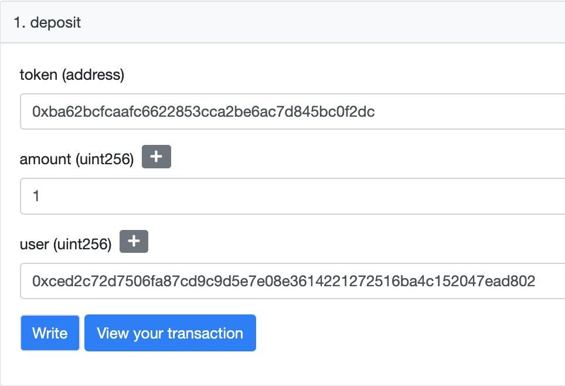
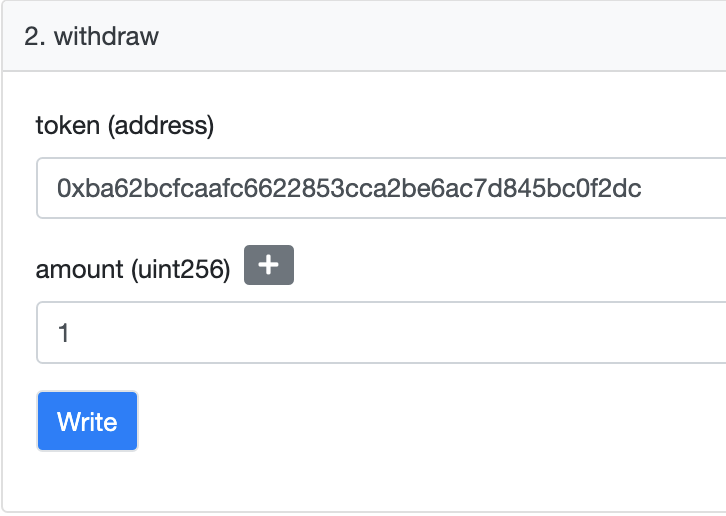

With the magic bridge we bring a seamless interface to bridge over all your ERC-20 tokens from Ethereum to the IC. Similar to our approach to the WETH Proxy on IC, the magic bridge is composed of mirror contracts on both chains for each token type, ERC20, and ERC721. The only difference is our magic factory on IC, which we will cover in the next section.

## Wow Bridge

To understand how the bridging works refer to our previous [article](https://medium.com/terabethia-bridge/terabethias-testnet-release-start-building-testing-on-the-bridge-58a0640a61aa) where we go into detail. In this section, we only focus on the magic bridge and the magic factory. 

We start on L1 with a new contract `ERC20Brdige` responsible for passing ERC-20 metadata in a message, which includes:

```
token        // address of the ERC20
user         // owner of the tokens
amount       // the amount we send over
tokenName    // the name of the ERC20
tokenSymbol  // the symbol of the ERC20
decimalds    // the decimals of the ERC20
```

The message then gets sent to our Terabethia canister on the IC to be processed, just like any other message. End users would only need to provide the token address, amount, and their wallet address. Everything else is pulled from the chain.

### ETH → IC

Once the message lands on the Terabethia IC canister, we send the message to the `DIP20Bridge`, which handles the message and verifies the origin Ethereum contract. Additionally, using our `MagicFactory`, the bridge checks if the origin ETH address has a corresponding pair canister. This  is the mirror address which will handle all the transactions for this specific origin ETH address. If one such pair canister does not exist, it will create one using the  metadata in the message and assign it 1-1 to the origin address. From there we can mint the incoming transaction within the corresponding canister `eth address -> canister_id` for `user`. 

### IC → ETH

The burn flow is very similar to our previous release with the `WETHProxy`, where you approve the `DIP20Proxy` for the amount you want to burn back to L1 and then call the `burn()`method on the `DIP20Bridge`. So how is the burn handled? Firstly, after the approve is initiated by the end user alongside the burn call, we make a transfer to our bridge canister for the same amount and credit the end user that same amount on our `DIP20Bridge`. Lastly, we `send_message` to the Terabethia IC canister. The local user credit becomes useful in case any of the other calls inside the function fail. With that, we don’t have to worry about any atomicity issues with these calls. Also, because we have control over the entire pipeline, we make the process fault tolerant. 

### ERC721 → DIP721

We are only a quarter away from a full support for the full range of token types. Now that we have proved that `ERC20 -> DIP20`, it is straightforward to tackle support for NFTs. The same approach will be used where we will have mirror contract/canisters on each chain and be able to send a messages using Terabethia layer. The factory and bridge for `DIP721` has already started, you can check out the repo.

---

### Example: ERC20 → DIP20 and back


To start bridging your ERC20 assets:

- Deposit L1 → L2
    
    <aside>
    🔗 ERC20Bridge Contract    
    
    [0x8CA1651eadeF97D3aC36c25DAE4A552c1368F27d](https://goerli.etherscan.io/address/0x8CA1651eadeF97D3aC36c25DAE4A552c1368F27d)

    DIP20Bridge Canister
    `767da-lqaaa-aaaab-qafka-cai`
    
    MagicFactory Canister
    `7z6fu-giaaa-aaaab-qafkq-cai`
    
    </aside>
    
    1. **Deposit to ERC20 bridge**
        - Three parameters required for deposit:
            - token: originating address of the ERC20 you are trying to send from
            - amount
            - user: the destination principal Id in the form of a hex for an identity you control on the Internet Computer
                
                ```jsx
                // Covnert from pincipal to hex
                import { Principal } from '@dfinity/principal';
                
                const hexString = Principal.fromText('<PID_HERE>').toHex().toLowerCase();
                ```
                
                
                
    2. **Check your balance on IC**
        - After you deposit your ERC20 token onto the Ethereum `ERC20Bridge`, our message sequencer picks up the message from the contract and delivers it to the `Terabethia IC` canister. This message is then delivered to our mirror `DIP20Bridge.`
            - If you send over the first transaction for the corresponding `ERC20`
                - a new 1-1 DIP20 canister will be created using our `MagicFactory`
            - if not we will use the 1-1 canister to mint your transaction
            
            <aside>
            ❓ Any canister spawned by our MagicFactory is controlled by the bridge
            
            </aside>
            
        
        - Before we can check our balance on the IC we need to get the corresponding 1-1 canister for our token  (this process will be automated in the Bridge UI).
            - Convert Token Ethereum address to principal
            
            ```bash
            import { Principal } from '@dfinity/principal';
            
            const pid = Principal.fromHex("<ETH_ADDR_WIHOUT_HEX_PREFIX>").toText()
            
            // 5keby-zqaaa-aaaaa-aaaaa-botcx-t6kv7-dgekc-tzsrl-42wh3-bc3yd-zny
            ```
            
            - Get 1-1, token associated canister
            
            ```bash
            // This is the token eth address represented as principal
            ETHADDR=5keby-zqaaa-aaaaa-aaaaa-botcx-t6kv7-dgekc-tzsrl-42wh3-bc3yd-zny
            
            dfx canister --network ic call 7z6fu-giaaa-aaaab-qafkq-cai get_canister "(principal \"$ETHADDR\")"
            ```
            
            - Now lets check our balance on IC
            
            ```bash
            ETHADDR=5keby-zqaaa-aaaaa-aaaaa-botcx-t6kv7-dgekc-tzsrl-42wh3-bc3yd-zny
            TOKENID=dfx canister --network ic call 7z6fu-giaaa-aaaab-qafkq-cai get_canister "(principal \"$ETHADDR\")"
            ID=$(dfx identity get-principal)
            
            dfx canister --network $NETWORK call $TOKENID balanceOf "(principal \"$ID\")"
            ```
            
            ***Thats it! You can now use this as any other DIP20.***
            
- Burn L2 → L1
    
    <aside>
    🔗 DIP20Bridge Canister
    `767da-lqaaa-aaaab-qafka-cai`
    
    DIP20Bridge Canister
    `767da-lqaaa-aaaab-qafka-cai`
    
    ERC20Bridge Contract
    [`0x8CA1651eadeF97D3aC36c25DAE4A552c1368F27d`](https://goerli.etherscan.io/address/0x8CA1651eadeF97D3aC36c25DAE4A552c1368F27d)
    
    </aside>
    
    1. Burn on DIP20Bridge canister
        - Here follows exactly the same as `WETHBridge`
            - Approve the `DIP20Bridge` to burn your DIP20 tokens
            
            ```bash
            # sh dip20-approve.sh 7icuz-piaaa-aaaaa-aabca-cai 1 
            
            TOKENID=$1
            AMOUNT=$2
            DIP20Bridge=767da-lqaaa-aaaab-qafka-cai
            
            dfx canister --network ic call $TOKENID approve "(
              principal \"$DIP20Bridge\", 
              $AMOUNT:nat
            )"
            ```
            
            - Burn your tokens by calling `burn`
                - must convert your receiving Ethereum address to principal
                    
                    ```jsx
                    import { Principal } from '@dfinity/principal';
                    
                    const pid = Principal.fromHex("<ETH_ADDR_WIHOUT_HEX_PREFIX>").toText()
                    ```
                    
            
            ```bash
            # sh dip20-burn.sh 7icuz-piaaa-aaaaa-aabca-cai 1
            
            TOKENID=$1
            AMOUNT=$2
            ETHADDR=2tos4-saaaa-aaaaa-aaaaa-b7mc2-6v2xq-kgc6m-n5nnf-3gasm-a752z-imy
            
            # approve proxy canister for an amount before burn
            dfx canister --network ic call dip20_proxy burn "(
              principal \"$TOKENID\", 
              principal \"$ETHADDR\", 
              $AMOUNT:nat
            )"
            ```
            
    2. Withdraw on ERC20Bridge contract
        - Two parameters required for withdraw:
            - token: original address of the ERC20 you are trying to withdraw
            - amount
                
                
                
                ***Noice! Now you have back your ERC20***
                
- - Manual Replays (WIP)
    
    Outside of normal operation there might be instances where some of the calls on the IC will partially succeed because of the asynchronous behaviour. We have built methods in to help you navigate in case of partial failures. We will continue to refine the UX after the release of our Bridge UI.
    
    - First of which is the manual Withdraw
        - this is built in case some funds were deducted and you aren’t able to withdraw them on Ethereum.
        - Use the Withdraw function on `DIP20Bridge`
    - Another useful method is the mint function in case the wasn’t able to handle the message.

---
## Native ETH Integration on the horizon?

How do we become more trustless? The answer is native ETH integration, which will allow us to query the state of the chain. This will enable non-interactive verifications right from the canisters, meaninng that it does not require any communication between the issuer and the holder. This feature will eliminate any reliance on any centralized network by allowing closed loop verifications and therefore eliminate the need for centralized infrastructure.

Our hope is that native ETH integration will work seamlessly with existing canisters or solidity smart contracts and expose an interface that developers can immediately leverage. One way is to use threshold signatures from the management API to sign transactions for Starknet just like you would from any wallet - simply generate the message payload and submit it to Starknet to be processed. This is a significant improvement from a security standpoint and reduces economic overhead by generating and submitting only the small input data needed for STARKs, instead of an entire transaction. Save on gas fees to reach finality quicker than a typical EVM smart contract execution. Along with our batch message (Coming soon) we can also improve our throughout for L2 → Starknet → L1.

---

## Deployed Contracts

- ETH
    - Goerli Terabethia - [`0x60DC1a1FD50F1cdA1D44dFf69Cec3E5C065417e8`](https://goerli.etherscan.io/address/0x60DC1a1FD50F1cdA1D44dFf69Cec3E5C065417e8)
    - Goerli EthProxy - [`0x2E130E57021Bb4dfb95Eb4Dd0dD8CFCeB936148a`](https://goerli.etherscan.io/address/0x2E130E57021Bb4dfb95Eb4Dd0dD8CFCeB936148a)
    - Goerli ERC20Bridge: [`0x8CA1651eadeF97D3aC36c25DAE4A552c1368F27d`](https://goerli.etherscan.io/address/0x8CA1651eadeF97D3aC36c25DAE4A552c1368F27d)
- IC
    - Testnet Terabethia - `timop-6qaaa-aaaab-qaeea-cai`
    - Testnet DIP20Bridge:  `767da-lqaaa-aaaab-qafka-cai`
    - Testnet MagicFactory: `7z6fu-giaaa-aaaab-qafkq-cai`
    - Testnet WETH Proxy - `tpni3-tiaaa-aaaab-qaeeq-cai`
        - Testnet WETH DIP20 - `tgodh-faaaa-aaaab-qaefa-cai`

---
